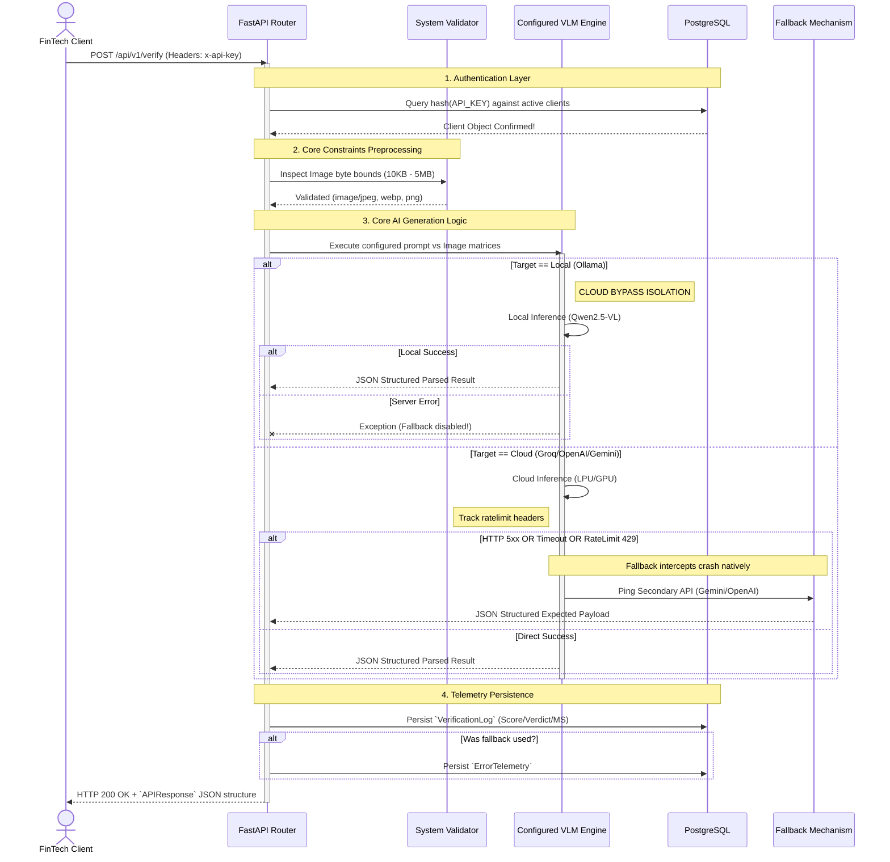

# GenSigLLM - Technical Flow

This document outlines the internal request processing pipeline of the signature verification backend engine.

## API Execution Flow

The architecture operates strictly synchronously to isolate verification streams matching single clients seamlessly. The process handles key abstraction, data-validations natively, and routes inference down three distinct LLM engines based on your system `.env` defaults.



## System Fault Tolerance Sequence

The `tenacity` library operates a powerful exponential backoff strategy protecting FinTech queries against sudden degradation. 

**If utilizing OpenAI/Gemini:**
1. Wait 2 seconds and retry.
2. Wait 4 seconds and retry.
3. Wait 8 seconds and retry. 
4. Upon 3 failures -> Break loop and swap connection routing gracefully.

**If utilizing Groq (Llama Vision):**
1. System dynamically captures `x-ratelimit-remaining-tokens`.
2. If the API returns a `RateLimitError` mapping to an exhausted playground quota, the system completely bypasses generic retries.
3. The AI routing engine instantly catches the `RateLimitError` subclass, writes a loud warning constraint to standard output, and forcefully executes the primary failover (`gemini-1.5-pro-latest`) yielding zero verification gaps for the end-user.

---

## Technical Walkthrough & Deployment Settings

The backend is organized utilizing standard FastAPI domain-driven design, maximizing configurability:

```text
GenSigLLM/
├── .env
├── .env.example
├── docker-compose.yml
├── Dockerfile
└── app/
    ├── main.py                 # FastAPI application and initial middleware
    ├── api/
    │   ├── deps.py             # Security dependencies (API Key extraction)
    │   └── v1/endpoints.py     # The /verify and /internal/clients routes
    ├── core/
    │   ├── config.py           # Pydantic env variable loading
    │   ├── logger.py           # Loguru rotation config
    │   ├── security.py         # SHA-256 Hashing logic
    │   └── utils.py            # Image constraints validator
    ├── db/
    │   ├── database.py         # SQLAlchemy engine connection
    │   └── models.py           # Schema tables (clients, verification_logs)
    ├── schemas/
    │   └── payload.py          # Pydantic input/output serializers
    └── services/
        └── ai_service.py       # OpenAI / Gemini verification fallback logic
```

### Testing & Verifying The Application Locally

**1. Set Environment Variables**
Check the `.env` file natively. 
Populate `OPENAI_API_KEY`, `GEMINI_API_KEY` and `GROQ_API_KEY` before starting the core engine. Set `PRIMARY_LLM_PROVIDER` to `groq`, `openai`, `gemini`, or `ollama`.

**2. Start the Environment**
In your terminal, within `d:\PythonProjects\GenSigLLM`, run:
```bash
docker-compose up --build -d
```
> [!NOTE] 
> This will start PostgreSQL on `5432` and compile the fresh `app/main.py` FastAPI server onto `8000`.

**3. Create a Test Client**
Generate a testing API key via the internal admin route:
```bash
# Note: On Windows, utilizing curl requires escaping the quotes, or you can use Postman!
curl -X POST "http://localhost:8000/api/v1/internal/clients" \
     -H "Content-Type: application/json" \
     -d "{\"organization_name\": \"FinTech-Nepal\", \"tier\": \"standard\"}"
```
*Save the `api_key` it returns!*

**4. Verify Signatures**
Send your baseline and questioned signatures:

```bash
curl -X POST "http://localhost:8000/api/v1/verify" \
     -H "x-api-key: YOUR_GENERATED_API_KEY" \
     -F "genuine_image=@path/to/genuine.jpg" \
     -F "questioned_image=@path/to/questioned.jpg"
```
