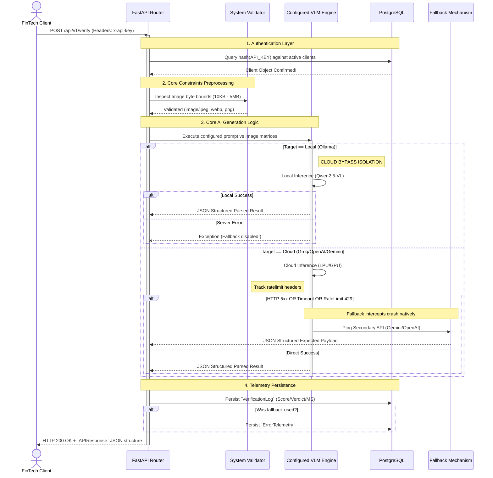
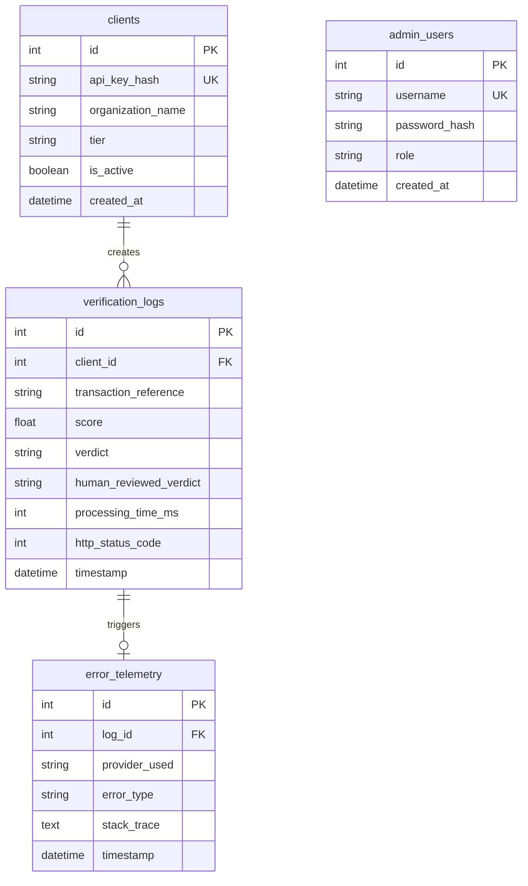

# GenSigLLM - Technical Flow

This document outlines the internal request processing pipeline of the signature verification backend engine.

## API Execution Flow

The architecture operates strictly synchronously to isolate verification streams matching single clients seamlessly. The process handles key abstraction, data-validations natively, and routes inference down three distinct LLM engines based on your system `.env` defaults.



## System Fault Tolerance Sequence

The `tenacity` library operates a powerful exponential backoff strategy protecting FinTech queries against sudden degradation. 

**If utilizing OpenAI/Gemini:**
1. Wait 2 seconds and retry.
2. Wait 4 seconds and retry.
3. Wait 8 seconds and retry. 
4. Upon 3 failures -> Break loop and swap connection routing gracefully.

**If utilizing Groq (Llama Vision):**
1. System dynamically captures `x-ratelimit-remaining-tokens`.
2. If the API returns a `RateLimitError` mapping to an exhausted playground quota, the system completely bypasses generic retries.
3. The AI routing engine instantly catches the `RateLimitError` subclass, writes a loud warning constraint to standard output, and forcefully executes the primary failover (`gemini-1.5-pro-latest`) yielding zero verification gaps for the end-user.

---

## Technical Walkthrough & Deployment Settings

The backend is organized utilizing standard FastAPI domain-driven design, maximizing configurability:

```text
GenSigLLM/
├── .env
├── .env.example
├── docker-compose.yml
├── Dockerfile
└── app/
    ├── main.py                 # FastAPI application and initial middleware
    ├── api/
    │   ├── deps.py             # Security dependencies (API Key extraction)
    │   └── v1/endpoints.py     # The /verify and /internal/clients routes
    ├── core/
    │   ├── config.py           # Pydantic env variable loading
    │   ├── logger.py           # Loguru rotation config
    │   ├── security.py         # SHA-256 Hashing logic
    │   └── utils.py            # Image constraints validator
    ├── db/
    │   ├── database.py         # SQLAlchemy engine connection
    │   └── models.py           # Schema tables (clients, verification_logs)
    ├── schemas/
    │   └── payload.py          # Pydantic input/output serializers
    └── services/
        └── ai_service.py       # OpenAI / Gemini verification fallback logic
```

### Testing & Verifying The Application Locally

**1. Set Environment Variables**
Check the `.env` file natively. 
Populate `OPENAI_API_KEY`, `GEMINI_API_KEY` and `GROQ_API_KEY` before starting the core engine. Set `PRIMARY_LLM_PROVIDER` to `groq`, `openai`, `gemini`, or `ollama`.

**2. Start the Environment**
In your terminal, within `d:\PythonProjects\GenSigLLM`, run:
```bash
docker-compose up --build -d
```
> [!NOTE] 
> This will start PostgreSQL on `5432` and compile the fresh `app/main.py` FastAPI server onto `8000`.

**3. Create a Test Client**
Generate a testing API key via the internal admin route:
```bash
# Note: On Windows, utilizing curl requires escaping the quotes, or you can use Postman!
curl -X POST "http://localhost:8000/api/v1/internal/clients" \
     -H "Content-Type: application/json" \
     -d "{\"organization_name\": \"FinTech-Nepal\", \"tier\": \"standard\"}"
```
*Save the `api_key` it returns!*

**4. Verify Signatures**
Send your baseline and questioned signatures:

```bash
curl -X POST "http://localhost:8000/api/v1/verify" \
     -H "<PRIMARY_LLM_PROVIDER>-API-KEY: YOUR_GENERATED_API_KEY" \
     -F "genuine_image=@path/to/genuine.jpg" \
     -F "questioned_image=@path/to/questioned.jpg"
```

## Detailed Application Request Flow

When the server is started via `uvicorn app.main:app --host 0.0.0.0 --port 8000`, the following chronological execution flow occurs:

### 1. Application Startup
*   **Method Called:** `app.main.startup_event()`
*   **Action:** Triggers the FastAPI `@app.on_event("startup")` hook.
*   **Values Passed/Loaded:** `settings.PROJECT_NAME` ("Signature Verification API") and other environment variables from `app.core.config.Settings`.
*   **Result:** Initializes the DB schema via `Base.metadata.create_all(bind=engine)` and starts the application listening on port 8000.

### 2. Client Registration Flow
*   **Endpoint Hit:** `POST /api/v1/internal/clients`
*   **Method Called:** `app.api.v1.endpoints.create_client(client_in: ClientCreate, db: Session)`
*   **Values Passed:** JSON payload with `organization_name` (e.g., "FinTech-Nepal") and `tier` (e.g., "standard").
*   **Result:** Generates a 32-byte URL-safe raw API key, hashes it via `app.core.security.hash_api_key`, saves the DB `Client` model, and returns the raw API key to the user in a `ClientResponse`.

### 3. Signature Verification Flow
*   **Endpoint Hit:** `POST /api/v1/verify`
*   **Method Called:** `app.api.v1.endpoints.verify_signature_endpoint()`
*   **Values Passed:** `genuine_image` (UploadFile), `questioned_image` (UploadFile), and `x-api-key` header.
*   **Dependencies Resolved:**
    *   `get_current_client(api_key: str, db: Session)`: Hashes the provided API key, queries the DB, and returns the authenticated `Client` object.
    *   `get_db()`: Yields a SQLAlchemy DB session.
*   **Validation:** Calls `app.core.utils.validate_image()` for both images (checks size constraints between 10KB and 5MB and valid MIME types).
*   **AI Inference Processing:** 
    *   **Method Called:** `app.services.ai_service.verify_signatures(genuine_image, questioned_image)`
    *   **Action:** Encodes files to base64, then routes to the active AI provider function (e.g., `call_groq`, `call_openai`, `call_gemini`, or `call_ollama`).
    *   **Values Passed to AI:** Base64 image strings and `settings.FORENSIC_PROMPT`.
    *   **Result:** The AI model returns a JSON string, which is parsed into a `VerificationResult` schema containing `verdict`, `score`, and `characteristics`.
*   **Telemetry DB Logging:**
    *   **Method Called:** `app.api.v1.endpoints._log_transaction()` via `run_in_threadpool`.
    *   **Values Passed:** DB session, `client.id`, UUID `transaction_ref`, `score`, `verdict`, `processing_time_ms`, and any `fallback_exception`.
    *   **Result:** Commits a `VerificationLog` and optionally an `ErrorTelemetry` record to PostgreSQL.
*   **Final Output:** Returns a JSON `APIResponse` containing the `transaction_reference`, `processing_time_ms`, and the nested `result`.

### 4. Health Check Flow
*   **Endpoint Hit:** `GET /health`
*   **Method Called:** `app.main.health_check()`
*   **Values Passed:** None.
*   **Result:** Returns a simple JSON dictionary `{"status": "ok", "service": "Signature Verification API"}`.

---

## Database Schema & Persistence Flow

The backend utilizes PostgreSQL combined with SQLAlchemy ORM (defined in `app/db/models.py`) to manage API consumers and trace verification metrics.

### Exposed Tables & Data Ingestion

#### 1. `clients`
*   **Purpose:** Manages authorized API consumers. It securely stores a SHA-256 hash of their generated API Key, their tier status, and their organization's identity.
*   **Populated By:** The `POST /api/v1/internal/clients` internal routing endpoint (`create_client` method).
*   **Read By:** The FastAPI Authentication Dependency middleware `get_current_client()` inside `app/api/deps.py` upon every secured request.

#### 2. `verification_logs`
*   **Purpose:** The core operational tracking table. It records the AI system's derived verdict, confidence score, and raw processing times for every single API interaction. It ties the transaction directly to the API Consumer.
*   **Populated By:** The `POST /api/v1/verify` endpoint via the background threaded function `_log_transaction()` inside `app/api/v1/endpoints.py`.

#### 3. `error_telemetry`
*   **Purpose:** A structural debugging and fallback tracking table. It captures the exact exception string, the failure type, and AI vendor metadata whenever the system undergoes an involuntary or fallback mechanism shift gracefully.
*   **Populated By:** Triggered internally by `_log_transaction()` inside `app/api/v1/endpoints.py` only if the `fallback_exception` flag is explicitly populated by the Verification generation logic inside `ai_service.py`.

#### 4. `admin_users`
*   **Purpose:** Stores credentials and RBAC access roles for administrative users managing internal functions or evaluating human-review logs.
*   **Populated By:** Interfaced by secure system-admin scripts or local database seeders.

### Entity Relationship (ER) Diagram


